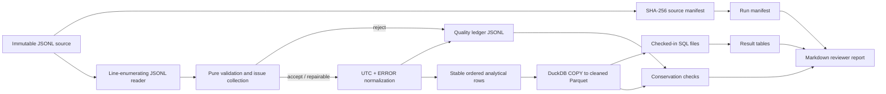

# Phase 1: Auditable Log Pipeline & Analysis - Research

**Researched:** 2026-08-11  
**Domain:** Local Python JSONL quality pipeline, deterministic Parquet analytics, and reproducible evidence  
**Confidence:** MEDIUM

<user_constraints>
## User Constraints (from CONTEXT.md)

### Locked Decisions
- **D-01:** Use conservative repair. Repair only defects whose intended value is lossless, unambiguous, and mechanically provable; never infer missing values from message meaning.
- **D-02:** Reject malformed JSON, invalid timestamps, and records missing fields required for the analysis rather than inventing replacements.
- **D-03:** For exact duplicate records, retain the first occurrence in cleaned Parquet and reject later copies. The quality ledger must cross-reference the retained and rejected source lines.
- **D-04:** Treat valid representation changes, such as converting an offset timestamp to the same UTC instant, as normalization rather than repair. Preserve original and normalized representations in evidence without inflating repaired-record totals.
- **D-05:** Capture every detected issue separately. Retain a record-level final action determined by explicit precedence: reject overrides repair, and repair overrides accept.

### Error normalization
- **D-06:** Normalize `ERROR` messages to stable semantic signatures parsed from the explicit error token, with structured handling where required, such as `HTTP_502`.
- **D-07:** Keep embedded values such as error codes, related components, and paths as secondary structured dimensions. They must not fragment the primary error-type ranking.
- **D-08:** Preserve every raw message. If a valid `ERROR` record does not match a known signature, retain it with `error_type = UNCLASSIFIED_ERROR` and report the unclassified count as a normalization-quality warning.
- **D-09:** Apply the error taxonomy only to `level=ERROR`. INFO and WARN messages remain available as raw content but do not require a general event taxonomy in this phase.

### Day boundaries and unusual-day language
- **D-10:** Normalize valid timestamp instants to UTC and use the UTC calendar date for the official daily report. Preserve the original timestamp and offset for provenance. This produces the advertised seven-day window from 2026-07-27 through 2026-08-02.
- **D-11:** Flag a day as unusual only when its cleaned error count exceeds twice the median daily error count. Report the observed ratio and describe the rule as a descriptive seven-day heuristic, not a statistical anomaly detector.
- **D-12:** Calculate daily counts only from accepted or repaired analytical records. Disclose rejected records and their reasons separately in the quality reconciliation instead of assigning them an artificial date.
- **D-13:** For each flagged day, show error contributions by service while avoiding unsupported claims about causation.

### Reviewer evidence experience
- **D-14:** Provide one canonical end-to-end command covering source-integrity checks, ingestion, cleaning, analysis, and verification. Also expose each stage through independently runnable commands.
- **D-15:** Generate one Markdown report as the primary review surface, containing all four customer answers, concise methodology notes, quality totals, unusual-day reasoning, and paths to detailed evidence.
- **D-16:** Place a direct evidence chain beside every reported answer: the SQL query, generated result table, cleaned-dataset hash, relevant row counts, and run-manifest entry.
- **D-17:** Commit the complete deterministic Phase 1 evidence snapshot: cleaned Parquet, full quality ledger, analysis tables, Markdown report, and manifest. Verification must regenerate the artifacts and check their hashes or internal consistency.

### the agent's Discretion
- Exact stable issue-code names, schema column names, module boundaries, CLI flag names, and output directory layout are left to research and planning, provided they preserve the decisions and evidence contracts above.
- The exact parser implementation for each recognized error signature is flexible, but rules must be explicit, deterministic, tested, and preserve raw messages.

### Deferred Ideas (OUT OF SCOPE)
None — discussion stayed within phase scope.
</user_constraints>

<phase_requirements>
## Phase Requirements

| ID | Description | Research Support |
|---|---|---|
| RPRO-01 | Reviewer can create the documented, locked Python environment and invoke the project verification commands from a clean checkout. | `uv.lock`, `uv sync --locked`, Make targets, and recorded runtime versions. |
| RPRO-02 | Reviewer can verify that supplied briefs, readings, logs, and operational documents remain unchanged through recorded source hashes. | A byte-stream SHA-256 manifest generated before and after the run. |
| PIPE-01 | Reviewer can run a Python command that reads every line of `docs/onboard/datapack/data/app_logs_7days.jsonl` while retaining source-line provenance. | Streaming enumerated JSONL reader; source line is carried into every ledger row and accepted record. |
| PIPE-02 | Reviewer can inspect validation code that detects and assigns stable issue codes to every discovered JSON, schema, type, timestamp, categorical, and content-quality problem. | Pure validation functions, an explicit issue catalogue, and fixtures for each observed class. |
| PIPE-03 | Reviewer can inspect an explicit rule and rationale for whether each issue type is accepted, narrowly repaired, or rejected without editing the source file. | Checked-in disposition table and final-action precedence. |
| PIPE-04 | Reviewer can inspect a per-record quality ledger containing source line, issue code, action, reason, and original versus normalized values where a repair occurs. | Deterministically ordered JSONL ledger plus concise summary tables. |
| PIPE-05 | Reviewer can verify row conservation and deterministic reruns: every input record is accounted for and repeated runs with the same inputs produce the same cleaned data and quality totals. | Reconciliation assertions, content hashes, stable sort order, and rerun verification. |
| PIPE-06 | Reviewer can query a structured Parquet dataset with a documented schema and a concise rationale for choosing the format. | DuckDB-written Parquet, schema JSON/Markdown, and checked-in `DESCRIBE` evidence. |
| PIPE-07 | Reviewer can reproduce which service has the most `ERROR` records across the seven-day period from checked-in SQL or pandas code and recorded results. | Dedicated SQL and result table sourced only from cleaned Parquet. |
| PIPE-08 | Reviewer can reproduce system-wide daily error counts and inspect the stated, evidence-based rule used to identify any unusual day without overstating statistical certainty. | UTC daily SQL, median/ratio calculation, and descriptive wording in the report. |
| PIPE-09 | Reviewer can reproduce the three most frequent normalized error types or codes and the associated service or services. | Error-token parser, secondary-dimension columns, top-three SQL, and result table. |
| PIPE-10 | Reviewer can reproduce rejected and repaired record counts grouped by issue type, with totals reconciling to the quality ledger. | Ledger aggregation SQL or Python summary and reconciliation assertion. |
| PIPE-11 | Reviewer can trace every reported pipeline answer to the cleaned dataset, executable analysis source, generated result table, and run manifest rather than to manual calculations. | One evidence manifest and report citations for every answer. |
</phase_requirements>

## Project Constraints (from AGENTS.md)

- Preserve all supplied inputs; generated datasets, indexes, and reports must be written outside the supplied source tree. [VERIFIED: AGENTS.md:14-15]
- Implement the pipeline in local Python; do not add AWS deployment work to this phase. [VERIFIED: AGENTS.md:11-13]
- Keep reviewer-facing material, code comments, reports, and evidence in English. [VERIFIED: AGENTS.md:13]
- Favor a complete, runnable, well-evidenced two-day POC over unnecessary complexity. [VERIFIED: AGENTS.md:10]
- Preserve the required top-level `pipeline/` deliverable area and build evidence that is reproducible and interview-defensible. [VERIFIED: AGENTS.md:5-8,16]
- Use the locked `uv` environment, DuckDB/Parquet, explicit standard-library validation, pytest, Ruff, Make, and SHA-256 evidence patterns already selected for this project. [VERIFIED: AGENTS.md:39-49,58-60]
- Commit work incrementally rather than creating one final squash commit. [VERIFIED: AGENTS.md:17]

## Summary

Build Phase 1 as a narrow, staged local CLI: hash immutable inputs; stream the JSONL once with source-line provenance; emit a record-level quality ledger; send only accepted/repairable records through deterministic timestamp and error normalization; write a fixed-order Parquet dataset; then run versioned SQL files to produce all four customer answers. This keeps data-quality decisions explicit and makes every report number mechanically traceable. [VERIFIED: AGENTS.md:68-70] [VERIFIED: 01-CONTEXT.md:17-43]

The source audit found 2,923 physical lines: 18 malformed JSON lines, 20 records with invalid timestamps, 18 records missing `level`, and 28 later exact duplicates. With the locked disposition rules, these are rejections; valid `Z`/`+07:00` timestamp conversions are normalizations, not repairs. The resulting expected cleaned-row count is 2,839 and requires an implementation-time reconciliation assertion rather than a hard-coded report constant. [VERIFIED: docs/onboard/datapack/data/app_logs_7days.jsonl (full scan, SHA-256 `f378486757df37c78fbabe4724d98260fe43ac61012c8f8588c50abc10499e1c`)] [VERIFIED: 01-CONTEXT.md:17-21,30-32]

**Primary recommendation:** Use one explicit Python pipeline with a JSONL audit ledger and DuckDB-generated Parquet; make the report a rendering of checked-in SQL result files and a manifest, never a manual calculation. [CITED: https://duckdb.org/docs/stable/clients/python/overview] [CITED: https://duckdb.org/docs/stable/data/parquet/overview]

## Architectural Responsibility Map

| Capability | Primary Tier | Secondary Tier | Rationale |
|---|---|---|---|
| Source-integrity verification and streaming ingestion | API / Backend (local CLI) | Database / Storage | A deterministic application process reads bytes and attaches line provenance; source files remain read-only. [VERIFIED: AGENTS.md:68-69] |
| Validation, disposition, duplicate detection, and normalization | API / Backend (local CLI) | — | These are business-quality rules that require explicit ordering and cannot be delegated to Parquet inference. [VERIFIED: 01-CONTEXT.md:17-27] |
| Cleaned analytical dataset and ledger persistence | Database / Storage | API / Backend | Parquet stores only analytical rows while JSONL retains audit decisions and original values. [VERIFIED: AGENTS.md:47-49] |
| Customer analysis | Database / Storage (DuckDB SQL) | API / Backend | SQL executes directly over Parquet; Python orchestrates query execution and output capture. [CITED: https://duckdb.org/docs/stable/data/parquet/overview] |
| Markdown report and run manifest | API / Backend (local CLI) | Database / Storage | The report should reference generated result files and hashes, not own independent calculations. [VERIFIED: 01-CONTEXT.md:36-39] |

## Standard Stack

### Core

| Library | Version | Purpose | Why Standard |
|---|---:|---|---|
| CPython | 3.12.3 available locally; project range `>=3.12,<3.15` | Streaming ingestion, validation, hashing, CLIs, JSON evidence | The project explicitly selects small named standard-library functions for transparent pipeline decisions. [VERIFIED: AGENTS.md:39-41] |
| `duckdb` [WARNING: flagged as suspicious — verify before using.] | `1.5.5` | Parquet writer and SQL analysis engine | DuckDB documents the Python client, JSON/Parquet readers, explicit connection objects, and Parquet output. [CITED: https://duckdb.org/docs/stable/clients/python/overview] [CITED: https://duckdb.org/docs/stable/data/parquet/overview] |

### Supporting

| Library / Tool | Version | Purpose | When to Use |
|---|---:|---|---|
| `uv` [WARNING: flagged as suspicious — verify before using.] | Record installed version in run metadata | Locked project environment | Use `uv lock`, `uv lock --check`, and `uv sync --locked`; do not hand-edit `uv.lock`. [CITED: https://docs.astral.sh/uv/concepts/projects/sync/] |
| `pytest` [WARNING: flagged as suspicious — verify before using.] | `9.1.1` starter pin | Deterministic unit and end-to-end checks | Validate every issue/disposition rule, reconciliation, output schema, and rerun determinism. [VERIFIED: AGENTS.md:58] |
| `ruff` [WARNING: flagged as suspicious — verify before using.] | `0.16.2` starter pin | Lint and format evidence | Run `ruff check .` and `ruff format --check .` through the canonical verification target. [VERIFIED: AGENTS.md:59] [CITED: https://docs.astral.sh/ruff/installation/] |

### Alternatives Considered

| Instead of | Could Use | Tradeoff |
|---|---|---|
| DuckDB + checked-in SQL | pandas plus a database server | The selected project stack rejects overlapping local data layers; DuckDB keeps Parquet I/O and SQL in one embedded dependency. [VERIFIED: AGENTS.md:47,79] |
| Explicit validation functions | Pydantic or Great Expectations | The selected project approach prioritizes visible per-field decisions and a small dependency surface for this fixed schema. [VERIFIED: AGENTS.md:41,80] |

**Installation:**

```bash
uv sync --locked
```

Run the required human-verification checkpoint before the first install; the local host currently lacks `uv` and `pip`, so Phase 1 must include the documented `uv` bootstrap as a prerequisite. [VERIFIED: environment probe 2026-08-11] [CITED: https://docs.astral.sh/uv/getting-started/installation/]

**Version verification:** The required PyPI CLI verification could not run because `python3 -m pip` is unavailable in this environment. The planner must run it after the `uv` bootstrap and record the exact resolved versions in `uv.lock` and the run manifest. [VERIFIED: environment probe 2026-08-11]

## Package Legitimacy Audit

| Package | Registry | Age | Downloads | Source Repo | Verdict | Disposition |
|---|---|---|---|---|---|---|
| `duckdb` | PyPI | Latest observed release published 2026-07-22 | unknown | `github.com/duckdb/duckdb-python` | SUS (`too-new`, unknown downloads) | Flagged — planner must add `checkpoint:human-verify` before install. [VERIFIED: package-legitimacy check] |
| `pytest` | PyPI | Latest observed release published 2026-06-19 | unknown | `github.com/pytest-dev/pytest` | SUS (unknown downloads) | Flagged — planner must add `checkpoint:human-verify` before install. [VERIFIED: package-legitimacy check] |
| `ruff` | PyPI | Latest observed release published 2026-08-07 | unknown | `docs.astral.sh/ruff` | SUS (`too-new`, unknown downloads) | Flagged — planner must add `checkpoint:human-verify` before install. [VERIFIED: package-legitimacy check] |
| `uv` | PyPI | Latest observed release published 2026-08-07 | unknown | `pypi.org/project/uv` | SUS (`too-new`, unknown downloads) | Flagged — planner must add `checkpoint:human-verify` before bootstrap. [VERIFIED: package-legitimacy check] |

**Packages removed due to [SLOP] verdict:** none.  
**Packages flagged as suspicious [SUS]:** `duckdb`, `pytest`, `ruff`, and `uv`; the planner must insert a human-verification checkpoint before each installation or bootstrap.

## Architecture Patterns

### System Architecture Diagram



The only branch that reaches Parquet is the analytical accept/repair path; every source line reaches the ledger, including malformed JSON that cannot produce a structured record. [VERIFIED: 01-CONTEXT.md:17-21,36-39]

### Recommended Project Structure

```text
pipeline/
├── __main__.py                 # stage-oriented CLI
├── integrity.py                # byte hashes and source inventory
├── ingest.py                   # line reader and source-line envelope
├── validation.py               # pure checks, issues, and final disposition
├── normalize.py                # UTC and ERROR parser
├── models.py                   # typed internal records / ledger rows
├── write_outputs.py            # atomic deterministic JSONL, Parquet, manifest writers
├── analysis.py                 # invokes checked-in SQL and writes tables
└── sql/
    ├── 01_service_error_counts.sql
    ├── 02_daily_error_counts.sql
    ├── 03_top_normalized_errors.sql
    └── 04_quality_reconciliation.sql
data/
├── processed/                  # generated Parquet only
└── evidence/                   # generated ledger, tables, report, manifest
tests/
└── pipeline/                   # unit and end-to-end fixtures
```

The names are recommended planner choices within the explicit discretion over module boundaries and output layout. [VERIFIED: 01-CONTEXT.md:41-43]

### Pattern 1: Envelope Every Input Line Before Parsing

**What:** Create an immutable envelope containing `source_line`, raw bytes/text, input path, and source SHA-256 context before calling `json.loads`. Emit at least one ledger entry even when parsing fails. [CITED: https://docs.python.org/3/library/json.html]

**When to use:** Always; this is the mechanism that makes malformed source content traceable rather than invisible. [VERIFIED: 01-CONTEXT.md:17-21]

**Example:**

```python
# Source: https://docs.python.org/3/library/json.html
for source_line, raw_line in enumerate(input_file, start=1):
    try:
        record = json.loads(raw_line)
    except json.JSONDecodeError as exc:
        emit_ledger(source_line=source_line, raw_line=raw_line, error=exc)
        continue
    validate_record(source_line=source_line, record=record)
```

### Pattern 2: Collect All Issues, Then Derive One Final Action

**What:** Return a list of all independently detected issues and derive action with a single precedence function: `reject` overrides `repair`, which overrides `accept`. This prevents a later check from hiding an earlier defect. [VERIFIED: 01-CONTEXT.md:17-21]

**When to use:** For every parseable record, including duplicates that are otherwise structurally valid. [VERIFIED: 01-CONTEXT.md:18-21]

### Pattern 3: Stable Artifact Construction

**What:** Iterate source lines in numeric order, sort SQL output by deterministic keys, serialize JSON with deterministic key order, use a fixed Parquet writer configuration, and replace completed files atomically. Do not embed wall-clock timestamps in artifacts that must hash-identically; put an explicit run timestamp only in the manifest. [ASSUMED]

**When to use:** Every artifact that Phase 1 commits and verifies by hash. [VERIFIED: 01-CONTEXT.md:36-39]

### Anti-Patterns to Avoid

- **Using a bulk JSON reader that skips bad rows:** it breaks source-line accounting; parse one physical line and record every failure. [VERIFIED: AGENTS.md:68-69]
- **Mutating the raw JSONL to “clean” it:** it violates the supplied-pack instruction and destroys evidence. [VERIFIED: docs/onboard/datapack/README.md:16-19]
- **Treating UTC conversion as a repair:** it falsely inflates data-quality results; preserve original and normalized representations separately. [VERIFIED: 01-CONTEXT.md:20]
- **Deduplicating by a subset of fields:** the decision is exact duplicate only; use the canonical raw record (or canonical full-record digest) and cross-reference the first source line. [VERIFIED: 01-CONTEXT.md:19]
- **Generating report prose from values recomputed separately from the committed SQL tables:** it creates a second, unverifiable calculation path. [VERIFIED: 01-CONTEXT.md:36-39]

## Don't Hand-Roll

| Problem | Don't Build | Use Instead | Why |
|---|---|---|---|
| Parquet encoder / decoder | A custom binary or CSV analytics format | DuckDB Parquet read/write support | Parquet schema, encoding, compression, and SQL scanning are established capabilities. [CITED: https://duckdb.org/docs/stable/data/parquet/overview] |
| SQL aggregation engine | Python loops that separately calculate each customer answer | Checked-in DuckDB SQL | One executable query surface is easier to inspect and connects directly to Parquet. [VERIFIED: AGENTS.md:47,70] |
| JSON parser and SHA-256 implementation | Regex-based JSON parsing or custom hashing | `json` and `hashlib` from CPython | `json.loads` supplies `JSONDecodeError`; `hashlib.sha256(...).hexdigest()` supplies a standard hex digest. [CITED: https://docs.python.org/3/library/json.html] [CITED: https://docs.python.org/3/library/hashlib.html] |
| Time-zone conversion | Manual offset arithmetic | Aware `datetime` and `astimezone(timezone.utc)` | This preserves the instant and avoids the local-time behavior of naive datetimes. [CITED: https://docs.python.org/3/library/datetime.html] |

**Key insight:** Custom business validation is required; custom parsers, hash algorithms, storage formats, and analytical engines are not. [VERIFIED: AGENTS.md:41,47-49,79-80]

## Common Pitfalls

### Pitfall 1: Counting lines only after successful parsing

**What goes wrong:** The quality report appears to reconcile clean rows and rejects but silently loses malformed lines.  
**Why it happens:** JSON parsing happens before the pipeline assigns provenance.  
**How to avoid:** Enumerate physical lines first and create a ledger event from the raw line on both success and failure. [CITED: https://docs.python.org/3/library/json.html]  
**Warning signs:** `input_line_count != final-action-record-count`; the ledger lacks the source line shown as malformed in the raw file. [VERIFIED: docs/onboard/datapack/data/app_logs_7days.jsonl:39]

### Pitfall 2: Double-counting quality issues as records

**What goes wrong:** Grouped issue totals exceed rejected-record totals and the report calls that a mismatch.  
**Why it happens:** The phase deliberately requires every issue to be captured while one record receives one final action.  
**How to avoid:** Report both `issue_occurrences` and `records_by_final_action`; reconcile input lines to final actions, not to issue occurrences. [VERIFIED: 01-CONTEXT.md:21]

### Pitfall 3: Calendar dates follow source text instead of UTC instants

**What goes wrong:** A `+07:00` event near midnight is assigned to the wrong official day.  
**Why it happens:** The input contains both `Z` and `+07:00` forms, including records textually dated 2026-08-03 that normalize into the requested UTC window. [VERIFIED: docs/onboard/datapack/data/app_logs_7days.jsonl:2900-2910] [VERIFIED: 01-CONTEXT.md:30]  
**How to avoid:** Require an offset, parse an aware `datetime`, preserve the original value, convert once to UTC, and derive `event_date_utc` from that instant. [CITED: https://docs.python.org/3/library/datetime.html]  
**Warning signs:** More than seven dates in the official daily table or a disagreement between local-text and UTC date at a boundary.

### Pitfall 4: Ranking raw messages instead of semantic error types

**What goes wrong:** Variable transaction IDs or user IDs fragment otherwise identical failures.  
**Why it happens:** The raw data carries identifiers inside ERROR messages.  
**How to avoid:** Parse the explicit error token into a stable primary `error_type`; retain IDs, codes, components, and paths as secondary columns. [VERIFIED: 01-CONTEXT.md:24-27]

### Pitfall 5: Non-deterministic artifacts

**What goes wrong:** A rerun changes hashes despite unchanged source data.  
**Why it happens:** Unordered collections, unstable SQL output order, timestamps inside artifacts, or writer defaults vary.  
**How to avoid:** Fix ordering, isolate wall-clock data in the manifest, and assert deterministic content hashes in an end-to-end test. [ASSUMED]

## Code Examples

Verified patterns from official sources:

### Parse an aware ISO timestamp and canonicalize to UTC

```python
# Source: https://docs.python.org/3/library/datetime.html
from datetime import datetime, timezone

def normalize_timestamp(raw_timestamp: str) -> datetime:
    parsed = datetime.fromisoformat(raw_timestamp)
    if parsed.tzinfo is None:
        raise ValueError("timestamp must include a UTC offset")
    return parsed.astimezone(timezone.utc)
```

The rule requiring an offset is a recommended pipeline constraint; the supplied valid records use offset-bearing timestamp representations. [ASSUMED] [VERIFIED: docs/onboard/datapack/data/app_logs_7days.jsonl (full scan)]

### Query a generated Parquet file with a dedicated DuckDB connection

```python
# Source: https://duckdb.org/docs/stable/clients/python/reference/
import duckdb

with duckdb.connect() as connection:
    rows = connection.execute(
        "SELECT service, COUNT(*) AS error_count "
        "FROM read_parquet(?) "
        "WHERE level = ? "
        "GROUP BY service "
        "ORDER BY error_count DESC, service ASC",
        [str(parquet_path), "ERROR"],
    ).fetchall()
```

This uses an explicit connection and parameterized execution; DuckDB documents that the Python module global connection is shared and recommends connection objects for package code. [CITED: https://duckdb.org/docs/stable/clients/python/overview] [CITED: https://duckdb.org/docs/stable/clients/python/reference/]

## State of the Art

| Old Approach | Current Approach | When Changed | Impact |
|---|---|---|---|
| Re-lock or mutate dependencies implicitly during ordinary execution | Run `uv` commands with `--locked` for reviewer verification | Current uv behavior | An outdated lock becomes a visible error rather than a silent environmental change. [CITED: https://docs.astral.sh/uv/concepts/projects/sync/] |
| Global `duckdb.sql()` state in reusable Python code | A dedicated `duckdb.connect()` connection | Current DuckDB Python guidance | Avoids shared global connection behavior and makes the CLI's SQL lifecycle explicit. [CITED: https://duckdb.org/docs/stable/clients/python/overview] |

**Deprecated/outdated:** Do not use a naive datetime convention for UTC data; the Python documentation recommends aware UTC datetimes because naive values are commonly treated as local time. [CITED: https://docs.python.org/3/library/datetime.html]

## Assumptions Log

| # | Claim | Section | Risk if Wrong |
|---|---|---|---|
| A1 | A fixed writer configuration plus stable ordering produces byte-identical Parquet across repeated runs on the same locked platform. | Architecture Patterns / Pitfall 5 | Hash comparison could fail due to writer metadata; the plan must test this immediately. |
| A2 | Requiring an explicit timestamp offset is the appropriate strict policy for future parseable records. | Code Examples | A future valid but offset-less source record would be rejected; document this as a schema rule. |

## Open Questions

1. **Should the implementation explicitly enforce the observed five-service and three-level enumerations, or only require non-empty strings?**
   - What we know: the phase requires categorical validation, while the context leaves exact issue-code names and schema details discretionary. [VERIFIED: REQUIREMENTS.md:21] [VERIFIED: 01-CONTEXT.md:41-43]
   - What's unclear: no supplied schema contract states whether a new service or level is invalid rather than a valid future category.
   - Recommendation: enforce a known level allowlist for this fixed POC and reject unknown levels with a dedicated issue; do not reject a non-empty unknown service unless the brief supplies an allowlist. [ASSUMED]

2. **What repair category will be reported?**
   - What we know: all observed rejected defects are unrepairable under the locked conservative rule, while timestamp representation conversion is normalization rather than repair. [VERIFIED: docs/onboard/datapack/data/app_logs_7days.jsonl (full scan)] [VERIFIED: 01-CONTEXT.md:17-21]
   - What's unclear: no observed defect has a mechanically provable repaired value.
   - Recommendation: implement the repair branch and report a zero count if the run has no repairable record; do not invent a repair merely to make the category non-zero. [ASSUMED]

## Environment Availability

| Dependency | Required By | Available | Version | Fallback |
|---|---|---|---|---|
| CPython | Pipeline runtime | ✓ | 3.12.3 | — |
| GNU Make | Canonical/stage commands | ✓ | 4.3 | Direct documented `uv run` commands only if Make is unavailable to a reviewer. |
| Git | Incremental evidence commits | ✓ | 2.43.0 | — |
| `uv` | Locked environment | ✗ | — | Official bootstrap, then record `uv --version`. [CITED: https://docs.astral.sh/uv/getting-started/installation/] |
| `pip` | Ecosystem version-verification command | ✗ | — | Use `uv` after human verification; record resolution in `uv.lock`. |
| DuckDB Python client | Parquet generation and SQL | ✗ | — | Install through locked `uv` environment after checkpoint. |
| pytest / Ruff | Test and lint verification | ✗ | — | Install through locked `uv` environment after checkpoint. |

**Missing dependencies with no fallback:** None after the planned, human-verified `uv` bootstrap.  
**Missing dependencies with fallback:** `uv`, pip-based registry inspection, DuckDB, pytest, and Ruff are absent now but are provisioned through the locked project environment.

## Security Domain

### Applicable ASVS Categories

| ASVS Category | Applies | Standard Control |
|---|---|---|
| V2 Authentication | no | Local offline pipeline has no authentication surface in Phase 1. [VERIFIED: ROADMAP.md:20-29] |
| V3 Session Management | no | Local CLI has no session state. [VERIFIED: ROADMAP.md:20-29] |
| V4 Access Control | yes | Treat supplied paths as fixed project inputs; write generated files only to explicit output directories and never modify source paths. [VERIFIED: AGENTS.md:14-15,68] |
| V5 Input Validation | yes | Parse line-by-line, enforce required fields/types/categories/timestamps, retain raw provenance, and emit explicit rejects. [VERIFIED: REQUIREMENTS.md:20-24] |
| V6 Cryptography | yes | Use `hashlib.sha256` for integrity evidence; do not implement a digest algorithm. [CITED: https://docs.python.org/3/library/hashlib.html] |

### Known Threat Patterns for this stack

| Pattern | STRIDE | Standard Mitigation |
|---|---|---|
| Malformed or oversized JSONL line consumes excessive resources | Denial of Service | Stream one line at a time, record a parser failure, and impose a documented maximum line size before parsing. [CITED: https://docs.python.org/3/library/json.html] [ASSUMED: maximum value] |
| Path traversal or accidental source overwrite via CLI argument | Tampering | Resolve input paths under the project root, reject source-tree output targets, and require explicit generated-output roots. [VERIFIED: AGENTS.md:14-15] |
| SQL injection from dynamic identifiers or file paths | Tampering | Keep SQL files static and use DuckDB parameterized execution for values/paths. [CITED: https://duckdb.org/docs/stable/clients/python/reference/] |
| Accidental disclosure of raw records in logs | Information Disclosure | Store necessary raw content only in the reviewer ledger, avoid debug dumps, and keep output locations documented. [ASSUMED] |

## Sources

### Primary (HIGH confidence)

- [Supplied data pack README](docs/onboard/datapack/README.md) — immutable-source instruction and seven-day/five-system scope. [VERIFIED: docs/onboard/datapack/README.md:7-19]
- [Supplied assessment brief](docs/onboard/01_Domain_POC.md) — Python-local pipeline and four requested analyses. [VERIFIED: docs/onboard/01_Domain_POC.md:55-75]
- [Phase context](01-CONTEXT.md) — locked disposition, normalization, day-boundary, and evidence decisions. [VERIFIED: 01-CONTEXT.md:17-43]
- [Raw log](../../docs/onboard/datapack/data/app_logs_7days.jsonl) — anomaly counts and boundary examples established by full scan. [VERIFIED: docs/onboard/datapack/data/app_logs_7days.jsonl (full scan)]

### Secondary (MEDIUM confidence)

- [uv locking and syncing](https://docs.astral.sh/uv/concepts/projects/sync/) — lock freshness, `--locked`, and exact synchronization.
- [DuckDB Python API](https://duckdb.org/docs/stable/clients/python/overview) and [Python reference](https://duckdb.org/docs/stable/clients/python/reference/) — current client version, connection behavior, and parameterized execution.
- [DuckDB Parquet guide](https://duckdb.org/docs/stable/data/parquet/overview) — scans, schema inspection, and `COPY` output.
- [Python `json`](https://docs.python.org/3/library/json.html), [`hashlib`](https://docs.python.org/3/library/hashlib.html), and [`datetime`](https://docs.python.org/3/library/datetime.html) — parser errors, SHA-256, and aware UTC conversion.
- [uv installation](https://docs.astral.sh/uv/getting-started/installation/) and [Ruff installation](https://docs.astral.sh/ruff/installation/) — official tooling installation choices.

### Tertiary (LOW confidence)

- None; all assumptions are listed above for implementation-time confirmation.

## Metadata

**Confidence breakdown:**
- Standard stack: MEDIUM — the project stack and official documentation agree, but the package-legitimacy seam rated all required packages SUS and the host cannot run `pip` registry verification yet.
- Architecture: HIGH — directly constrained by locked Phase 1 decisions and a full scan of the supplied source.
- Pitfalls: MEDIUM — core pitfalls are source-grounded; byte-identical writer behavior and future-schema policy require tests.

**Research date:** 2026-08-11  
**Valid until:** 2026-08-18 for package/tooling details; source-data findings remain valid while the input hash remains unchanged.
